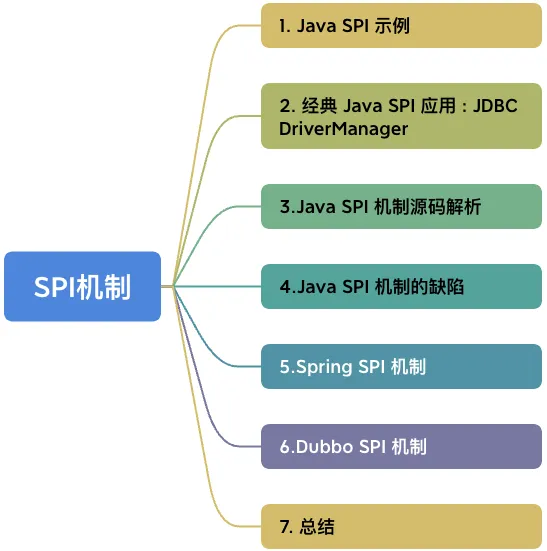

# spi-practice
多种spi实现机制与原理剖析

SPI 全称为 Service Provider Interface，是一种服务发现机制。

SPI 的本质是将接口实现类的全限定名配置在文件中，并由服务加载器读取配置文件，加载实现类。这样可以在运行时，动态为接口替换实现类。正因此特性，我们可以很容易的通过 SPI 机制为我们的程序提供拓展功能。

## Java SPI 机制的缺陷

- 不能按需加载，需要遍历所有的实现，并实例化，然后在循环中才能找到我们需要的实现。
- 如果不想用某些实现类，或者某些类实例化很耗时，它也被载入并实例化了，这就造成了浪费。
- 获取某个实现类的方式不够灵活，只能通过 Iterator 形式获取，不能根据某个参数来获取对应的实现类。
- 多个并发多线程使用 ServiceLoader 类的实例是不安全的。

## Spring SPI 

Spring SPI 机制与Java SPI非常类似 ，但还是有一些差异：

- Java SPI 是一个服务提供接口对应一个配置文件，配置文件中存放当前接口的所有实现类，多个服务提供接口对应多个配置文件，所有配置都在 services 目录下。
- Spring  SPI 是一个 spring.factories 配置文件存放多个接口及对应的实现类，以接口全限定名作为key，实现类作为value来配置，多个实现类用逗号隔开，仅 spring.factories 一个配置文件。

和 Java SPI 一样，Spring SPI 也无法获取某个固定的实现，只能按顺序获取所有实现。

## Dubbo SPI 机制

- 基于 Java SPI 的缺陷无法支持按需加载接口实现类，Dubbo 并未使用 Java SPI，而是重新实现了一套功能更强的 SPI 机制。
- Dubbo SPI 的相关逻辑被封装在了 ExtensionLoader 类中，通过 ExtensionLoader，我们可以加载指定的实现类。
- Dubbo SPI 除了支持按需加载接口实现类，还增加了 IOC 和 AOP 等特性 。