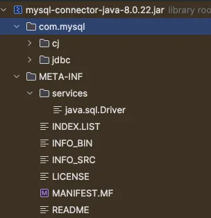
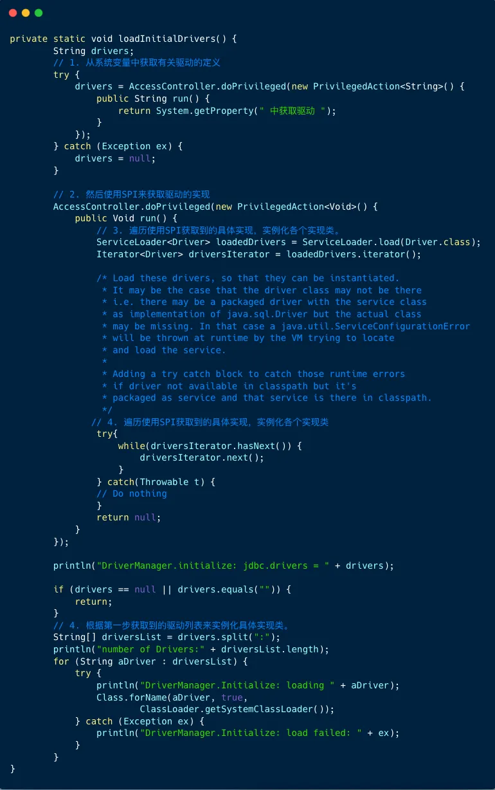

# 经典 Java SPI 应用 : JDBC DriverManager

在JDBC4.0 之前，我们开发有连接数据库的时候，通常先加载数据库相关的驱动，然后再进行获取连接等的操作。
```java
// STEP 1: Register JDBC driver
Class.forName("com.mysql.jdbc.Driver");
// STEP 2: Open a connection
String url = "jdbc:xxxx://xxxx:xxxx/xxxx";
Connection conn = DriverManager.getConnection(url,username,password);
```

JDBC4.0之后使用了 Java 的 SPI 扩展机制，不再需要用 Class.forName("com.mysql.jdbc.Driver") 来加载驱动，直接就可以获取 JDBC 连接。

接下来，我们来看看应用如何加载 MySQL JDBC 8.0.22 驱动：



首先 DriverManager类是驱动管理器，也是驱动加载的入口。
```java
/**
* Load the initial JDBC drivers by checking the System property
* jdbc.properties and then use the {@code ServiceLoader} mechanism
  */
  static {
  loadInitialDrivers();
  println("JDBC DriverManager initialized");
  }
```

在 Java 中，static 块用于静态初始化，它在类被加载到 Java 虚拟机中时执行。

静态块会加载实例化驱动，接下来我们看看loadInitialDrivers 方法。



加载驱动代码包含四个步骤：

1. 系统变量中获取有关驱动的定义。 
2. 使用 SPI 来获取驱动的实现类（字符串的形式）。 
3. 遍历使用 SPI 获取到的具体实现，实例化各个实现类。
4. 根据第一步获取到的驱动列表来实例化具体实现类。

我们重点关注 SPI 的用法，首先看第二步，使用 SPI 来获取驱动的实现类 , 对应的代码是：
```java
ServiceLoader<Driver> loadedDrivers = ServiceLoader.load(Driver.class);

```
这里没有去 META-INF/services目录下查找配置文件，也没有加载具体实现类，做的事情就是封装了我们的接口类型和类加载器，并初始化了一个迭代器。

接着看第三步，遍历使用SPI获取到的具体实现，实例化各个实现类，对应的代码如下：
```java

Iterator<Driver> driversIterator = loadedDrivers.iterator();
//遍历所有的驱动实现
while(driversIterator.hasNext()) {
driversIterator.next();
}
```
在遍历的时候，首先调用driversIterator.hasNext()方法，这里会搜索 classpath 下以及 jar 包中所有的META-INF/services目录下的java.sql.Driver文件，并找到文件中的实现类的名字，此时并没有实例化具体的实现类。

然后是调用driversIterator.next()方法，此时就会根据驱动名字具体实例化各个实现类了，现在驱动就被找到并实例化了。