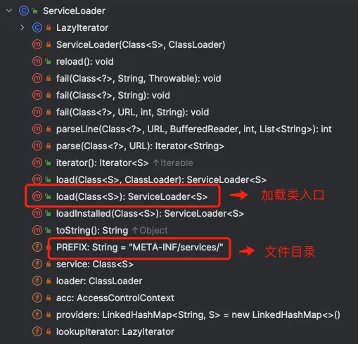

# Java SPI 机制源码解析


进入 ServiceLoader 类的load方法：
```java
public static <S> ServiceLoader<S> load(Class<S> service) {
    ClassLoader cl = Thread.currentThread().getContextClassLoader();
    return ServiceLoader.load(service, cl);
}

public static <S> ServiceLoader<S> load(Class<S> service , ClassLoader loader) {
    return new ServiceLoader<>(service, loader);
}
```
上面的代码，load 方法会通过传递的服务类型和类加载器classLoader 创建一个 ServiceLoader 对象。
```java

private ServiceLoader(Class<S> svc, ClassLoader cl) {
    service = Objects.requireNonNull(svc, "Service interface cannot be null");
    loader = (cl == null) ? ClassLoader.getSystemClassLoader() : cl;
    acc = (System.getSecurityManager() != null) ? AccessController.getContext() : null;
    reload();
}

// 缓存已经被实例化的服务提供者，按照实例化的顺序存储
private LinkedHashMap<String,S> providers = new LinkedHashMap<>();

public void reload() {
    providers.clear();
    lookupIterator = new LazyIterator(service, loader);
}
```
私有构造器会创建懒迭代器 LazyIterator 对象 ，所谓懒迭代器，就是对象初始化时，仅仅是初始化，只有在真正调用迭代方法时，才执行加载逻辑。

示例代码中创建完 serviceLoader 之后，接着调用iterator()方法：
```java
Iterator<Robot> iterator = serviceLoader.iterator();

// 迭代方法实现
public Iterator<S> iterator() {
return new Iterator<S>() {
Iterator<Map.Entry<String,S>> knownProviders
= providers.entrySet().iterator();

          public boolean hasNext() {
                if (knownProviders.hasNext())
                    return true;
                return lookupIterator.hasNext();
          }

          public S next() {
                if (knownProviders.hasNext())
                    return knownProviders.next().getValue();
                return lookupIterator.next();
          }

          public void remove() {
                throw new UnsupportedOperationException();
          }
     };
}
```

迭代方法的实现本质是调用懒迭代器 lookupIterator 的 hasNext() 和 next() 方法。

1. hasNext() 方法
```java
public boolean hasNext() {
    if (acc == null) {
        return hasNextService();
    } else {
        PrivilegedAction<Boolean> action = new PrivilegedAction<Boolean>() {
            public Boolean run() { return hasNextService(); }
        };
        return AccessController.doPrivileged(action, acc);
    }
} 
```
懒迭代器的hasNextService方法首先会通过加载器通过文件全名获取配置对象 Enumeration<URL> configs ，然后调用解析parse方法解析classpath下的META-INF/services/目录里以服务接口命名的文件。
```java
private boolean hasNextService() {
        if (nextName != null) {
              return true;
        }
        if (configs == null) {
             try {
                 String fullName = PREFIX + service.getName();
                 if (loader == null)
                     configs = ClassLoader.getSystemResources(fullName);
                 else
                     configs = loader.getResources(fullName);
              } catch (IOException x) {
                    fail(service, "Error locating configuration files", x);
              }
         }
         while ((pending == null) || !pending.hasNext()) {
             if (!configs.hasMoreElements()) {
                  return false;
             }
             pending = parse(service, configs.nextElement());
         }
         nextName = pending.next();
         return true;
}
```
当 hasNextService 方法返回 true ， 我们可以调用迭代器的 next 方法 ，本质是调用懒加载器 lookupIterator 的 next() 方法：

2. next() 方法
```java
public S next() {
       if (acc == null) {
            return nextService();
       } else {
            PrivilegedAction<S> action = new PrivilegedAction<S>() {
                 public S run() { return nextService(); }
            };
            return AccessController.doPrivileged(action, acc);
       }
}
```

```java
Robot robot = iterator.next();

// 调用懒加载器 lookupIterator 的  `next()` 方法
private S nextService() {
          if (!hasNextService())
              throw new NoSuchElementException();
          String cn = nextName;
          nextName = null;
          Class<?> c = null;
          try {
              c = Class.forName(cn, false, loader);
          } catch (ClassNotFoundException x) {
             fail(service,
                   "Provider " + cn + " not found");
          }
          if (!service.isAssignableFrom(c)) {
              fail(service,
                     "Provider " + cn  + " not a subtype");
          }
          try {
              S p = service.cast(c.newInstance());
              providers.put(cn, p);
              return p;
          } catch (Throwable x) {
              fail(service,
                     "Provider " + cn + " could not be instantiated",
                     x);
          }
          throw new Error();  // This cannot happen
  }
```
通过反射方法 Class.forName() 加载类对象，并用newInstance方法将类实例化，并把实例化后的类缓存到providers对象中，(LinkedHashMap<String,S>类型，然后返回实例对象。